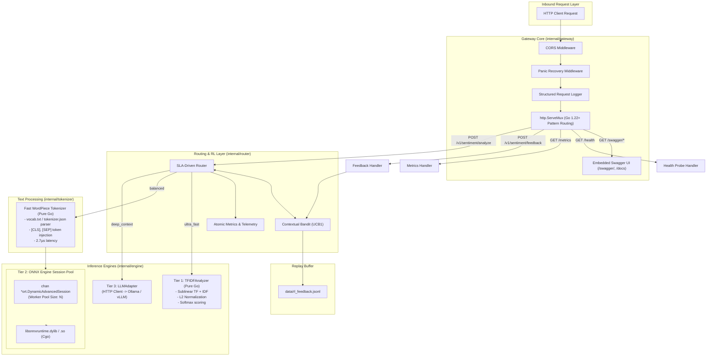

# Go Inference Gateway High-Level Design (HLD)

---

## 1. Serving Philosophy & Design Goals

The **Sentix Go Inference Gateway** serves as the central high-performance microservice layer.

### Core Architectural Principles:
1. **Zero-Cgo for Sub-Millisecond Paths**: Cgo context switching imposes a $50–150$ nanosecond overhead and pins OS threads. For Tier 1 (`ultra_fast`), Sentix uses a pure Go linear vectorizer to achieve true sub-millisecond execution ($6.1$ µs).
2. **Session Pooling for Neural Paths**: ONNX Runtime sessions are not re-allocated per request. A buffered pool of sessions (`chan *DynamicAdvancedSession`) handles concurrent evaluations without mutex contention.
3. **Embedded Self-Sufficiency**: The Go binary embeds all API documentation, OpenAPI 3.0 schemas, and Swagger UI static assets via `//go:embed`.
4. **Adaptive SLA Routing**: Dynamically balances accuracy and latency using an online Contextual Bandit (UCB1).

---

## 2. Gateway Component Diagram



---

## 3. Concurrency & Thread-Safety Model

Sentix is engineered for high-concurrency cloud environments:

### Session Pool Pattern:
- In `internal/engine/tier2/onnx_engine.go`, multiple dynamic ONNX sessions are instantiated during gateway initialization and enqueued into a buffered channel:
  ```go
  sessionPool := make(chan *ort.DynamicAdvancedSession, poolSize)
  ```
- When an inference request arrives on a worker goroutine:
  1. A session is leased from the channel (`session := <-sessionPool`).
  2. The input tensors (`input_ids`, `attention_mask`) are bound to dynamic shapes `[1, sequence_length]`.
  3. `session.Run()` executes the underlying C++ ONNX graph.
  4. The session is returned to the channel in a `defer` block (`sessionPool <- session`).
- This guarantees zero memory allocations for sessions in the request loop and bounds peak memory usage.

### Atomic Metrics Telemetry:
- Request counts, tier hits, and fallbacks use lock-free CPU primitives via `sync/atomic`:
  ```go
  atomic.AddInt64(&r.metrics.TotalRequests, 1)
  atomic.AddInt64(&r.metrics.Tier1Hits, 1)
  ```

### Thread-Safe Online Bandit Updates:
- The `ContextualBandit` uses a `sync.RWMutex`:
  - `SelectArm()` acquires a read lock (`RLock`), allowing concurrent arm scoring across thousands of goroutines.
  - `RecordReward()` acquires a write lock (`Lock`) for sub-microsecond atomic updates to empirical mean rewards and pull counters.

---

## 4. Subsystem Responsibilities

| Subsystem | Package | Primary Responsibility |
| :--- | :--- | :--- |
| **Gateway Server** | `internal/gateway` | Configures HTTP routes, executes middleware, parses JSON, and validates schemas. |
| **Swagger Controller** | `internal/gateway` | Serves interactive Swagger UI HTML and embedded raw OpenAPI 3.0 specification. |
| **SLA Router** | `internal/router` | Maps strategy (`ultra_fast`, `balanced`, `deep_context`, `auto`) to engine tiers with fallback guarantees. |
| **RL Bandit** | `internal/router` | Balances exploration and exploitation via UCB1; logs experience replay records to disk. |
| **WordPiece Tokenizer** | `internal/tokenizer` | Encodes raw text into token IDs and attention masks in microseconds without Python or external C dependencies. |
| **Tier 1 Engine** | `internal/engine/tier1` | Pure Go sparse TF-IDF vectorizer and logistic regression classifier. |
| **Tier 2 Engine** | `internal/engine/tier2` | Worker-pooled INT8 Transformer inference via Microsoft ONNX Runtime Cgo bindings. |
| **Tier 3 Adapter** | `internal/engine/tier3` | HTTP client adapter connecting to local LLMs with structured prompt wrappers. |

---

## 5. Graceful Lifecycle & Signal Handling

In `cmd/sentix/main.go`:
1. **Bootstrapping**:
   - Auto-discovers dynamic libraries (`libonnxruntime.dylib` / `.so`).
   - Pre-warms Tier 1 weights, Tier 2 session pool, and Tier 3 adapters.
   - Starts HTTP server on non-blocking goroutine.
2. **Signal Trapping**:
   - Listens for `os.Interrupt` (`SIGINT`) and `syscall.SIGTERM`.
3. **Shutdown Grace Period**:
   - Enforces a 5-second `context.WithTimeout` to allow in-flight HTTP requests to drain.
   - Invokes `Close()` on the ONNX session pool to destroy C++ ONNX sessions cleanly without memory leaks.
