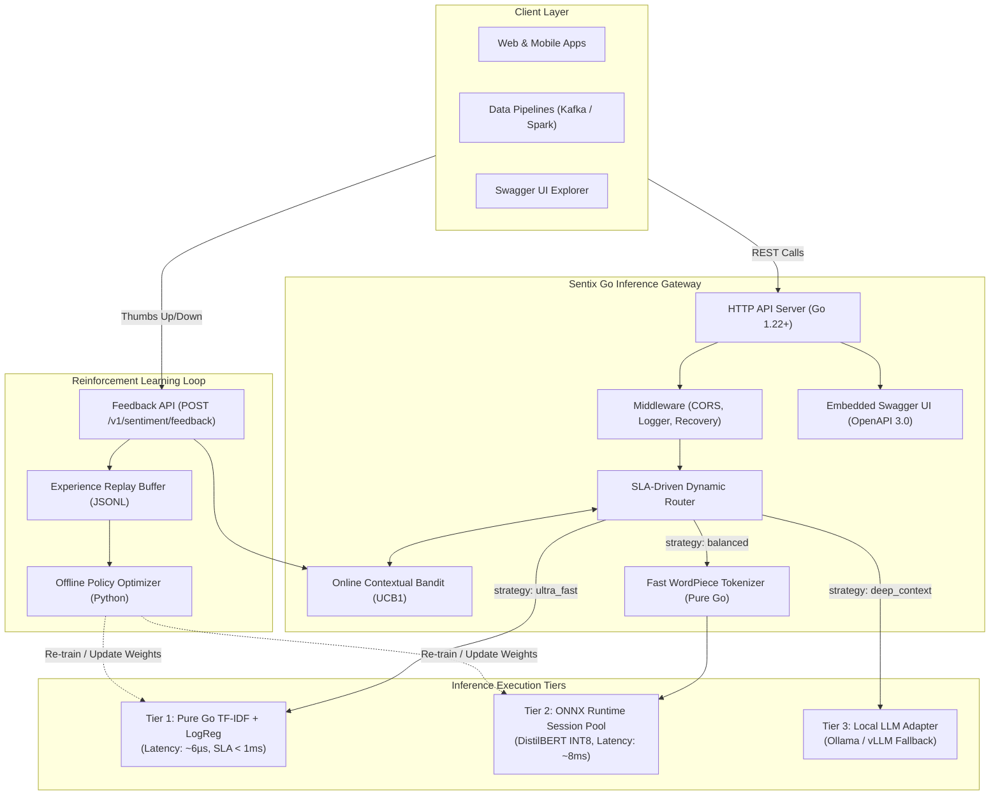
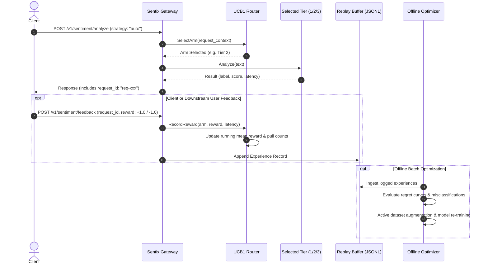

# System-Wide High-Level Design (HLD)

---

## 1. Executive Summary & Vision

Modern NLP systems often suffer from an architectural divide:
- **Offline Machine Learning (Python)**: Excellent for experimentation, transfer learning, fine-tuning, and metric evaluation (Hugging Face, PyTorch, Scikit-Learn).
- **Online Production Serving (Python Servers)**: Suffers from high memory footprints (often gigabytes per worker), Python Global Interpreter Lock (GIL) contention, unpredictable garbage collection pauses, and heavy container images.

**Sentix (PolySent)** solves this by operating as a **Task-Driven Sentiment Gateway**. It decouples offline model development in Python from production-grade, low-latency microservice serving in Go:

```
[ Offline ML Pipeline: Python ] ──( ONNX / Weights JSON Export )──► [ Production Gateway: Pure Go + Cgo ]
```

Instead of forcing all queries through a single expensive neural network, Sentix provides a **3-Tier Latency & Accuracy Architecture** governed by an **online Contextual Bandit (Reinforcement Learning)**.

---

## 2. High-Level Architecture Diagram



---

## 3. SLA-Driven Multi-Tier Strategy

Sentix treats latency and accuracy as explicit SLAs configured per request or resolved dynamically by the engine:

### Tier 1: Sub-Millisecond Gateway (`strategy: ultra_fast`)
- **Technology**: Vectorized TF-IDF with sublinear term frequency and n-gram $(1, 2)$ feature extraction paired with Logistic Regression.
- **Serving Path**: Pure Go with pre-allocated sparse maps and L2 vector normalization. **Zero Cgo overhead, zero dynamic library dependencies**.
- **Performance**:
  - **Empirical Latency**: **6.1 microseconds** ($\approx 0.006$ ms).
  - **Throughput**: $> 190,000$ req/sec per CPU core.
  - **SLA Guarantee**: $< 1.0$ ms.
- **Use Cases**: High-volume stream filtering, real-time comment moderation, coarse sentiment tagging.

### Tier 2: Balanced Deep Context (`strategy: balanced`)
- **Technology**: Fine-tuned Transformer (`distilbert-base-uncased-finetuned-sst-2-english`) exported to ONNX with dynamic batch and sequence axes.
- **Quantization**: Post-Training Dynamic INT8 Quantization (`QuantType.QInt8`), compressing model size from **255.55 MB to 64.47 MB** ($74.8\%$ reduction).
- **Serving Path**: Cgo bindings via `yalue/onnxruntime_go` connected to a worker pool of dynamic inference sessions. Text preprocessing handled by a microsecond pure Go WordPiece tokenizer.
- **Performance**:
  - **Empirical Latency**: **3.9–9.3 ms**.
  - **Throughput**: Parallelized across session worker pools.
  - **SLA Guarantee**: $15–40$ ms.
- **Use Cases**: Nuanced customer reviews, product sentiment, Aspect-Based Sentiment Analysis (ABSA).

### Tier 3: Zero-Shot Complex Reasoning (`strategy: deep_context`)
- **Technology**: Local LLM endpoint (Ollama / vLLM) hosting instruction-tuned models (Llama 3, Mistral, Qwen).
- **Serving Path**: Non-blocking HTTP client adapter with connection reuse and structured JSON prompt enforcement.
- **Performance**:
  - **Empirical Latency**: $200–800$ ms.
  - **SLA Guarantee**: High reasoning depth over strict latency.
- **Use Cases**: Ambiguous queries, sarcastic remarks, complex multi-clause reviews, and tie-breaking borderline predictions.

---

## 4. Reinforcement Learning Loop Architecture

Rather than relying on static heuristic rules to decide routing, Sentix integrates an **Online Contextual Bandit** paired with an **Offline Experience Replay Buffer**:



### Online Bandit Mechanics:
- **Algorithm**: Upper Confidence Bound 1 (UCB1) with exploration factor $c = \sqrt{2}$.
- **Objective Function**: Maximize empirical accuracy reward while penalizing latency:
  $$\text{Score}(a) = \hat{\mu}_a + c \cdot \sqrt{\frac{\ln N}{N_a}} - \lambda \cdot \left(\frac{\text{LatencyMs}_a}{100}\right)$$
- **Real-Time Adaptation**: Every feedback payload sent to `POST /v1/sentiment/feedback` incrementally updates the arm's running statistics without restarting the gateway.

---

## 5. Non-Functional Requirements & Design Principles

1. **Sub-Millisecond Baseline**: Tier 1 executes in pure Go with zero heap allocations in the hot path.
2. **Thread Safety & Session Pooling**: ONNX Runtime sessions are pooled in a buffered Go channel (`chan *ort.DynamicAdvancedSession`), preventing session contention across concurrent goroutines.
3. **Graceful Degradation**:
   - If Tier 3 fails or times out $\rightarrow$ falls back to Tier 2.
   - If Tier 2 encounters an inference error $\rightarrow$ falls back to Tier 1.
   - If `libonnxruntime` is not found on the host machine $\rightarrow$ gateway gracefully Boots into Tier 1 pure Go mode without crashing.
4. **Self-Contained Artifact**: The compiled binary (`bin/sentix`, $\approx 9.4$ MB) contains the embedded OpenAPI 3.0 specification and interactive Swagger UI.

---

## 6. Deployment Topology

Sentix is distributed as a hybrid artifact:
- **Compiled Go Gateway Binary**: `bin/sentix`
- **Dynamic Cgo Dependency**: `libonnxruntime.dylib` (macOS) or `libonnxruntime.so` (Linux).
- **Serialized Model Artifacts**:
  - `models/tier1_tfidf/weights.json` (Pure Go linear weights, 183 KB)
  - `models/tier2_distilbert/model_int8.onnx` (INT8 Quantized graph, 64.5 MB)
  - `models/tier2_distilbert/tokenizer.json` & `vocab.txt` (FastTokenizer assets)

Ready for containerization via a multi-stage `Dockerfile` with Microsoft ONNX Runtime base libraries.
