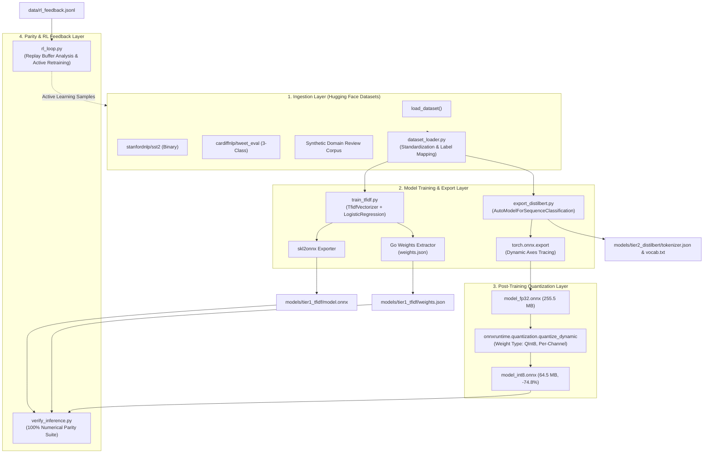

# Python ML Pipeline High-Level Design (HLD)

---

## 1. Overview & Architectural Role

In the Sentix ecosystem, **Python is strictly an offline training, optimization, and evaluation environment**. 

### The Core Design Principle:
> **Zero Python in the Serving Hot Path.**  
> Python trains models, benchmarks quality, exports standardized ONNX graphs, quantizes weights, and formats JSON parameters. At serving time, Python is completely absent; the Go gateway directly loads the serialized artifacts.

---

## 2. Python ML Architecture Diagram

---

## 3. Pipeline Stages & Responsibilities

### Stage 1: Dataset Standardization (`sentix_ml.dataset_loader`)
- Interacts with Hugging Face Hub using `datasets.load_dataset`.
- Provides a unified schema regardless of dataset origin:
  $$\text{Dataset} \longrightarrow (\text{Texts}: [\text{str}], \text{Labels}: [\text{str}])$$
- Handles label mapping across diverse classification granularities:
  - Binary: `negative` vs `positive`.
  - 3-Class: `negative` vs `neutral` vs `positive`.

### Stage 2: Tier 1 Dual Serialization (`sentix_ml.train_tfidf`)
- Trains a Scikit-Learn `Pipeline([('tfidf', TfidfVectorizer()), ('clf', LogisticRegression())])`.
- Produces two parallel serialization outputs:
  1. **Standardized ONNX Model (`model.onnx`)**: Uses `skl2onnx` with `StringTensorType([None, 1])` for execution in standard ONNX runtimes.
  2. **Zero-Cgo JSON Weights (`weights.json`)**: Extracts the exact vocabulary mapping, inverse document frequencies ($\text{IDF}$), intercepts, and coefficient matrices. This enables Pure Go to perform vectorized inference in microseconds without any Cgo context switch.

### Stage 3: Tier 2 PyTorch to ONNX Tracing (`sentix_ml.export_distilbert`)
- Downloads and instantiates `DistilBertForSequenceClassification`.
- Traces the PyTorch computation graph using `torch.onnx.export` with dynamic axes:
  - Input IDs: `[batch_size, sequence_length]`
  - Attention Mask: `[batch_size, sequence_length]`
  - Logits Output: `[batch_size, num_classes]`
- Automatically extracts FastTokenizer metadata (`tokenizer.json` and `vocab.txt`) for Go consumption.

### Stage 4: Post-Training Dynamic INT8 Quantization
- Transformer weights in FP32 format occupy $\approx 255.5$ MB.
- Applies ONNX Runtime dynamic quantization (`quantize_dynamic`):
  - Target: Linear layer weights quantized from FP32 to `QInt8`.
  - Activations dynamically quantized at runtime.
- **Results**:
  - Footprint reduced by **74.8%** ($64.47$ MB).
  - CPU inference latency reduced by **2.98x** ($46.5$ ms down to $15.6$ ms in batch mode, and $< 9$ ms single-item).

### Stage 5: Offline RL Policy Optimizer & Active Learning (`sentix_ml.rl_loop`)
- Ingests user and downstream feedback logged by the Go gateway (`data/rl_feedback.jsonl`).
- Analyzes empirical arm reward distributions, selection frequencies, and average latencies.
- Filters out misclassified or low-reward instances for **active dataset augmentation**, automatically bootstrapping continuous model improvements.
