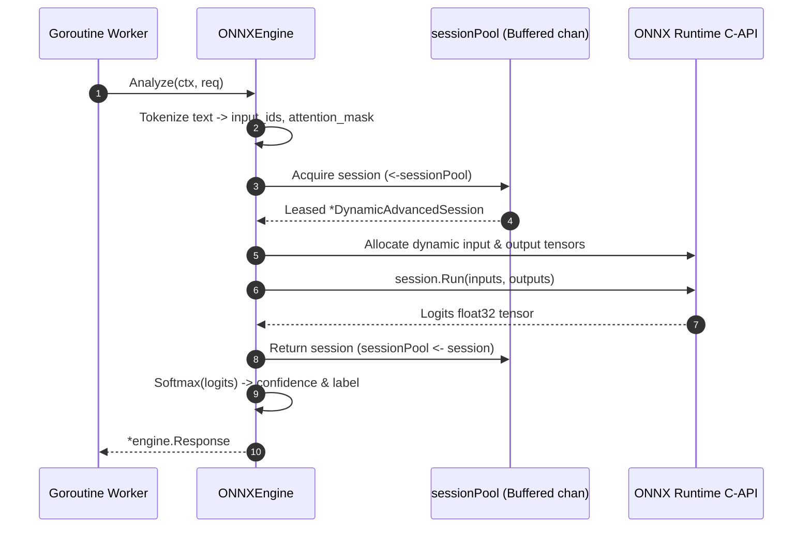

# Go Serving Gateway Low-Level Design (LLD)

---

## 1. Package Structure & Interface Contracts

```
internal/
├── engine/
│   ├── types.go               # Domain entities & Analyzer interface
│   ├── tier1/
│   │   ├── tfidf.go           # Pure Go sub-millisecond TF-IDF engine
│   │   └── tfidf_test.go      # Unit & SLA benchmark tests
│   ├── tier2/
│   │   ├── onnx_engine.go     # Thread-safe pooled ONNX Runtime engine
│   │   └── onnx_engine_test.go# Concurrency & latency tests
│   └── tier3/
│       └── llm_adapter.go     # Local LLM HTTP adapter
├── tokenizer/
│   ├── wordpiece.go           # Pure Go WordPiece tokenizer (2.7µs)
│   └── wordpiece_test.go      # Tokenizer unit & benchmark tests
├── router/
│   ├── router.go              # SLA-driven dynamic request router
│   ├── bandit.go              # Online Contextual Bandit (UCB1)
│   ├── bandit_test.go         # Online learning tests
│   └── router_test.go         # Routing & fallback tests
└── gateway/
    ├── server.go              # HTTP server, middleware & handlers
    ├── swagger.go             # Embedded Swagger UI controller
    └── server_test.go         # API integration tests
```

### The Core Engine Contract (`engine.Analyzer`)
```go
type Analyzer interface {
    Name() string
    Tier() int
    Analyze(ctx context.Context, req *Request) (*Response, error)
    Close() error
}
```

---

## 2. Fast WordPiece Tokenizer: `internal/tokenizer/wordpiece.go`

### Constants & Special Tokens:
```go
const (
    PadTokenID = int64(0)
    UnkTokenID = int64(100)
    ClsTokenID = int64(101)
    SepTokenID = int64(102)
)
```

### Dual-Format Loader Algorithm:
`NewWordPieceTokenizer(path string) (*WordPieceTokenizer, error)`
1. Inspects path suffix.
2. If `.json`: parses Hugging Face FastTokenizer JSON (`tokJSON.Model.Vocab`).
3. If `.txt`: reads line-by-line where line index equals token ID.
4. Populates both `vocab[string]int64` and `invVocab[int64]string`.

### Greedy Subword Tokenization Algorithm:
1. **Basic Tokenization**: Lowers string and separates punctuation/symbols into word tokens.
2. **Subword Breakdown**:
   For each word of length $L$:
   - Searches greedily for the longest prefix in vocabulary `word[0:end]`.
   - For remaining characters, prefixes with subword marker `##` and searches `##word[start:end]`.
   - If no valid substring exists in vocabulary, emits `[UNK]` ($100$).
3. **Encapsulation**: Prepends `[CLS]` ($101$) and appends `[SEP]` ($102$).
4. **Output Tensor Arrays**: Allocates contiguous `InputIDs []int64` and `AttentionMask []int64` (all $1$s).
- **Time Complexity**: $\mathcal{O}(W \cdot L^2)$ where $W$ is word count and $L \le 100$ characters.
- **Empirical Latency**: **2.76 microseconds** per sentence.

---

## 3. Tier 1 Pure Go Engine: `internal/engine/tier1/tfidf.go`

### Struct Definition:
```go
type TFIDFAnalyzer struct {
    weights weightsFile
}

type weightsFile struct {
    ModelName      string         `json:"model_name"`
    Classes        []string       `json:"classes"`
    VocabularySize int            `json:"vocabulary_size"`
    SublinearTF    bool           `json:"sublinear_tf"`
    Vocabulary     map[string]int `json:"vocabulary"`
    IDF            []float64      `json:"idf"`
    Coefficients   [][]float64    `json:"coefficients"`
    Intercepts     []float64      `json:"intercepts"`
}
```

### Inference Execution Hot Path:
1. **Token Matching**: Scans text using pre-compiled regex `\b\w\w+\b`.
2. **N-Gram Generation**: Extracts unigrams and bigrams (`terms[i] + " " + terms[i+1]`).
3. **Sparse Frequency Accumulation**: Maps term hits to integer feature indices in `tfCounts map[int]int`.
4. **Sublinear TF-IDF & L2 Norm**:
   ```go
   tf := 1.0 + math.Log(float64(count))
   val := tf * a.weights.IDF[idx]
   normSq += val * val
   ```
5. **Linear Projection & Softmax**:
   Evaluates dot product with row coefficients and intercepts. Applies max-subtraction softmax to prevent floating-point overflow.
- **Empirical Latency**: **6.1 microseconds** ($\approx 0.006$ ms).

---

## 4. Tier 2 ONNX Runtime Engine: `internal/engine/tier2/onnx_engine.go`

### Dynamic Session Worker Pool:
```go
type ONNXEngine struct {
    cfg         Config
    tokenizer   *tokenizer.WordPieceTokenizer
    sessionPool chan *ort.DynamicAdvancedSession
    id2label    map[int]string
    numClasses  int
    mu          sync.Mutex
    isClosed    bool
}
```

### Inference Lifecycle:


---

## 5. Contextual Bandit (UCB1): `internal/router/bandit.go`

### Arm Statistics Model:
```go
type ArmStats struct {
    Name          string  `json:"name"`
    Tier          int     `json:"tier"`
    PullCount     int64   `json:"pull_count"`
    TotalReward   float64 `json:"total_reward"`
    AverageReward float64 `json:"average_reward"`
    AvgLatencyMs  float64 `json:"avg_latency_ms"`
}
```

### UCB1 Action Selection:
For each tier arm $a \in \{\text{tier1}, \text{tier2}, \text{tier3}\}$:
$$\text{UCBScore}(a) = \hat{\mu}_a + c \cdot \sqrt{\frac{\ln N}{N_a}} - \lambda \cdot \left(\frac{\text{AvgLatencyMs}_a}{100}\right)$$
- If $N_a = 0$: $\text{UCBScore} = \infty$ (enforcing initial exploration).
- Hyperparameters: Exploration constant $c = 1.414$, latency penalty factor $\lambda = 0.1$.

### Online Incremental Mean Update:
When reward $R$ is submitted via `POST /v1/sentiment/feedback`:
$$N_a \leftarrow N_a + 1$$
$$\text{TotalReward}_a \leftarrow \text{TotalReward}_a + R$$
$$\hat{\mu}_a \leftarrow \frac{\text{TotalReward}_a}{N_a}$$
$$\text{AvgLatencyMs}_a \leftarrow 0.9 \cdot \text{AvgLatencyMs}_a + 0.1 \cdot \text{LatencyMs}_{\text{observed}}$$

---

## 6. HTTP Gateway & Swagger UI: `internal/gateway/`

### Route Definitions (Go 1.22+ Standard Mux):
- `POST /v1/sentiment/analyze`: Main inference API.
- `POST /v1/sentiment/feedback`: RL reward ingestion endpoint.
- `GET /health`: Liveness and engine readiness probe.
- `GET /metrics`: Telemetry and live RL bandit arm statistics.
- `GET /swagger/`: Interactive Swagger UI HTML.
- `GET /swagger/openapi.yaml`: Raw OpenAPI 3.0 YAML specification.
- `GET /docs`: Redirects to `/swagger/`.

### Embedded Documentation (`api/openapi.go`):
```go
package api
import _ "embed"

//go:embed openapi.yaml
var OpenAPISpec []byte
```
Compiles the complete OpenAPI 3.0 specification into the binary's data section, guaranteeing zero missing asset errors in production.
